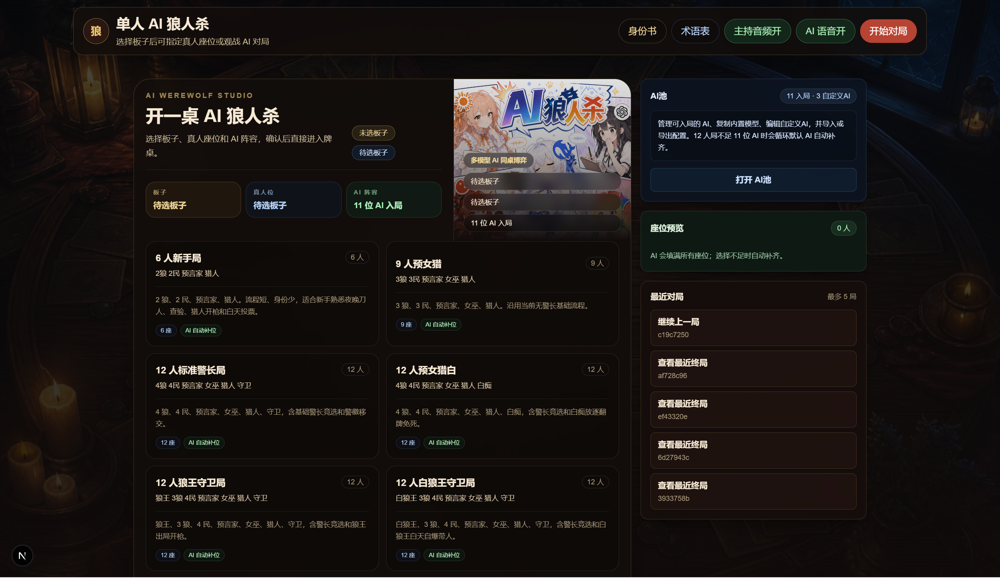
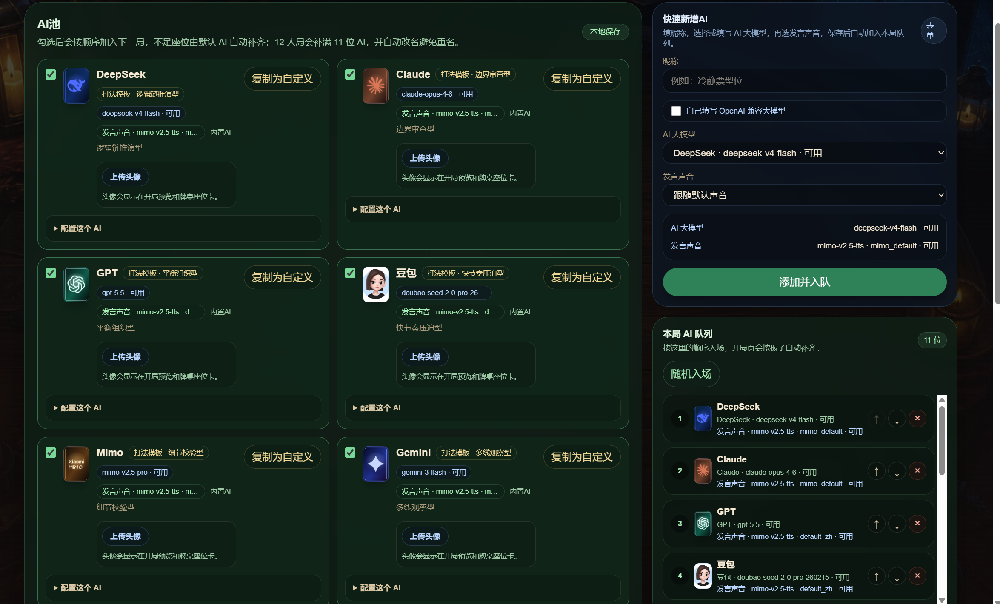
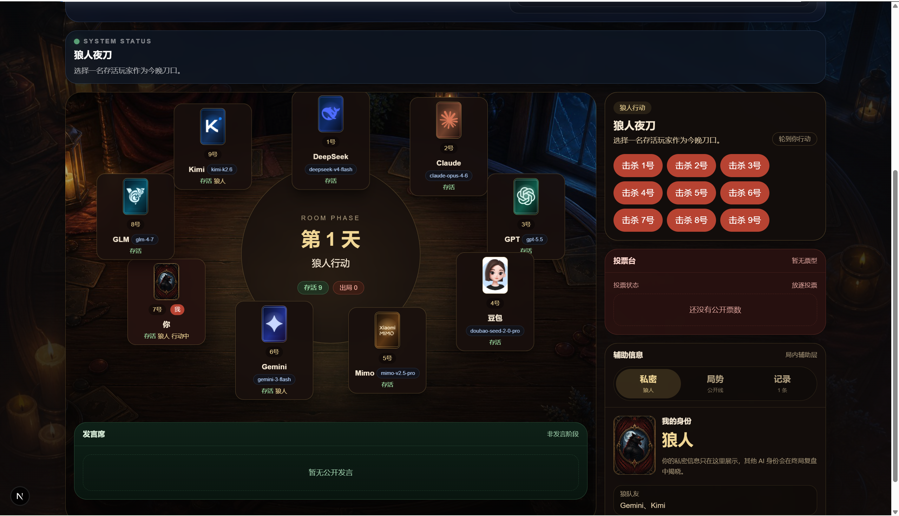

# AI 狼人杀 Alpha

一个 AI 狼人杀 Alpha 试玩项目。你可以在本地和一桌 AI 玩家完成一局狼人杀，也可以通过公网 Alpha 房间邀请朋友一起小范围试玩。

AI agent 参与本仓库开发时，请先阅读 [AGENTS.md](AGENTS.md)，再根据任务范围进入 `docs/README.md`、`docs/threads/` 和 `docs/tasks/`。

当前项目有两条试玩路径：

- 本地 Release ZIP：适合第一次体验、演示 AI 发言和测试不同板子。
- 公网 Public Alpha：适合小范围朋友试玩多人房间，验证手机端进房、开局、行动、投票和刷新恢复。

Public Alpha 还不是开放公测，不承诺长期稳定运营。

## 公网试玩

- 主试玩链接：https://175.178.199.245
- 备用镜像：https://ai-werewolf-free.onrender.com
- 联机房间：https://175.178.199.245/rooms
- 试玩说明：https://175.178.199.245/alpha-playtest
- 健康面板：https://175.178.199.245/alpha-health

公网试玩建议先使用 mock AI，不需要 API Key，也不会产生模型费用。第一波试玩重点不是扩散，而是收集 P0/P1 问题：打不开、进不了房、开不了局、行动失败、刷新丢身份、手机按钮难点和错误提示不清楚。

## 下载试玩

Windows 试玩推荐直接下载 Release ZIP：

1. 打开 [v0.1.2-alpha 发布页](https://github.com/MaQinglin-665/ai-werewolf/releases/tag/v0.1.2-alpha)。
2. 在页面底部 `Assets` 里下载 `Source code (zip)`，或直接下载 [v0.1.2-alpha.zip](https://github.com/MaQinglin-665/ai-werewolf/archive/refs/tags/v0.1.2-alpha.zip)。
3. 先解压 ZIP，再双击解压后目录里的 `start-alpha.bat`。
4. 第一次启动会自动安装依赖、初始化本地 SQLite 数据库，并用 Mock 试玩模式打开浏览器。

Mock 试玩不需要 API Key，不调用真实大模型，也不需要配置 TTS。

## 界面预览

### 开局入口



### AI 池配置



### 牌桌对局



## 快速试玩

### Windows 推荐方式

1. 安装 Node.js 20 或更新版本。
2. 从 [最新 Release](https://github.com/MaQinglin-665/ai-werewolf/releases/tag/v0.1.2-alpha) 下载 `Source code (zip)`，解压到本地。
3. 双击解压后根目录的 `start-alpha.bat`。
4. 等脚本自动进入 mock 模式、安装依赖、初始化 SQLite 数据库并打开浏览器。

mock 模式不需要 API Key，也不需要配置 TTS，最适合第一次试玩。之后可以在 `/ai-pool` 的“对局 AI 模式”里切换到“真实 LLM”。

### 命令行方式

```powershell
git clone https://github.com/MaQinglin-665/ai-werewolf.git
cd ai-werewolf
Copy-Item .env.example .env
npm install
npm run prisma:generate
npm run db:push
npm run dev
```

然后打开 http://localhost:3000。

## Mock 模式

如果你手动编辑 `.env`，确认这几项是：

```env
AI_SPEECH_PROVIDER="mock"
AI_ACTION_PROVIDER="mock"
AI_LLM_PROVIDER="mock"
```

这个模式会使用本地 AI 策略和本地发言，不会调用真实大模型。
也可以直接在 AI 池右侧选择“Mock 试玩”。该选择会保存到浏览器本地，并在对局推进时强制绕过真实 LLM。

## 当前能力

- 支持 6 人新手局、9 人预女猎，以及多种 12 人警长板子。
- 支持真人随机身份、指定座位，或选择“无真人”进入 AI 观战局。
- 支持公网房间小范围试玩，可创建房间、邀请玩家、同步在线状态、开局、行动和刷新恢复。
- 支持预言家、女巫、猎人、守卫、白痴、狼王、白狼王、狼美人、骑士等规则链路。
- 规则引擎负责状态机、合法动作、药品、开枪、警徽流转和屠边胜负。
- AI 可自动推进非真人阶段，支持复盘、公开逻辑线索和模拟测试。
- 页面提供本地牌桌 UI、AI 池、自定义大模型和声音配置。

## 真实大模型

真实大模型是可选项。想让不同 AI 使用不同模型时，打开 `/ai-pool`：

1. 在右侧“对局 AI 模式”选择“真实 LLM”。
2. 展开左侧 AI 卡片。
3. 填写 OpenAI-compatible `Base URL`、模型名和 API Key。
4. 点击“保存到这个 AI”。
5. 回到首页开局。

API Key 只保存在你自己的浏览器本地，不会写入 GitHub，也不会导出到对局配置里。

如果你想让启动脚本直接打开 AI 池，可以在 PowerShell 里运行：

```powershell
powershell -NoProfile -ExecutionPolicy Bypass -File scripts/start-alpha.ps1 -Mode app
```

## TTS 语音

TTS 不是必填项。

- 不配置 TTS：游戏仍然可以正常玩；主持流程会播放仓库内置音频片段，AI 发言以文字为主。
- 配置 TTS：打开 `/ai-pool`，给单个 AI 填写 TTS Base URL、TTS API Key、模型和 voice。

建议第一次试玩先不要配置 TTS，确认能顺利开局、推进和复盘后再尝试真实语音。

## 试玩流程

1. 选择板子。
2. 选择真人座位，或选择“无真人”观看 AI 对局。
3. 点击进入牌桌。
4. 按当前阶段完成行动：夜刀、查验、用药、发言、投票或开枪。
5. 其他 AI 会自动行动，对局会推进到下一次需要你操作的位置。
6. 终局后查看复盘，确认身份、夜晚行动、投票和胜负原因。

## 常见问题

### mock 模式是什么？

mock 模式就是离线试玩模式。它不需要 API Key，不调用真实大模型，也不会产生模型费用。AI 会使用项目内置的本地策略自动发言和行动。在 AI 池选择“Mock 试玩”后，即使某些 AI 已经保存了模型配置，本局推进也不会调用真实 LLM。

### TTS 需要配置吗？

不需要。没有配置 TTS 时，游戏仍然可以正常玩；主持流程会播放仓库内置音频片段，AI 发言以文字为主。

### 为什么第一次启动比较慢？

第一次启动会自动安装 npm 依赖、生成 Prisma Client 并初始化 SQLite 数据库，时间主要取决于网络和电脑性能。后续启动会快很多。

### 双击后打不开页面怎么办？

先看启动窗口里打印的 localhost 地址。默认是 http://localhost:3000；如果 3000 端口被占用，脚本会自动尝试附近可用端口。也可以确认 Node.js 版本是否为 20 或更新版本。

## 常用命令

```powershell
npm run lint
npm run test
npx tsc --noEmit
npm run build
npm run simulate:ai
```

## 当前限制

- 这是 Alpha 试玩版，不是公网运营版本。
- 公网房间只适合小范围朋友试玩，还没有账号、匹配、封禁、付费、客服和开放运营流程。
- 腾讯云是主试玩环境，Render 只是备用镜像，免费实例可能冷启动或暂时不可用。
- 真实大模型和云 TTS 会增加等待时间，也可能产生 API 费用。
- AI 表现会随模型、配置和随机种子变化，规则引擎仍然是最终裁判。

## API

- `POST /api/games` 创建新局。
- `GET /api/games/:gameId` 获取当前真人玩家的脱敏视角。
- `POST /api/games/:gameId/commands` 提交当前动作。
- `POST /api/games/:gameId/voice-input` 将真人语音转写整理为发言或遗言草稿，不推进游戏状态。
- `POST /api/rooms` 创建公网房间。
- `POST /api/rooms/:roomId/join` 加入房间。
- `GET /api/rooms/:roomId/view` 获取房间内当前玩家视角。
- `GET /api/rooms/:roomId/stream` 订阅房间 SSE 更新。
